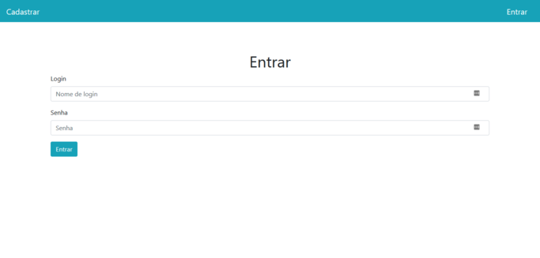

## To do list

 Projeto com objetivo de revisitar os tópicos principais relacionados ao desenvolvimento com Spring boot.

### Tecnologias usadas

    Spring
        - Spring boot ✔️
        - Spring security ✔️
        - Spring data JPA ✔️
    MySQL ✔️
    Thymeleaf ✔️
    Bean validation ✔️

### Tela de login

### Dependências externas

    Bootstrap ✔️
        - jQuery
        - Popper.js